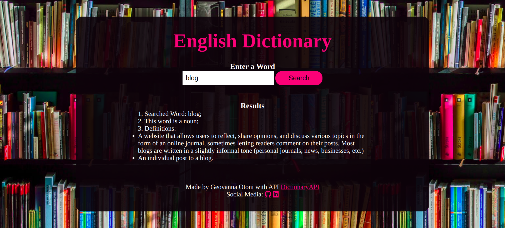

# English Dictionary
Projeto Pessoal de um dicionário do idioma inglês que exibe a definição da palavra pesquisada pela pessoa usuária, a partir da API DictionaryAPI.  

## :computer: Visualize este projeto:
Acesse a página aqui:
[geovannaotoni-english-dictionary.surge.sh](geovannaotoni-english-dictionary.surge.sh)

## :bulb: Habilidades:
Feito a partir dos conhecimentos de CSS, HTML, JavaScript, DOM, Eventos, API, NPM, Vite, Promisses, Fetch, Async e Await.
